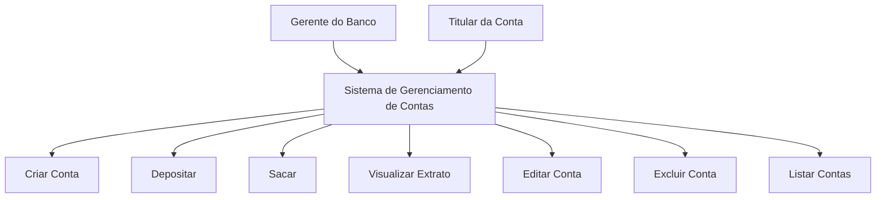
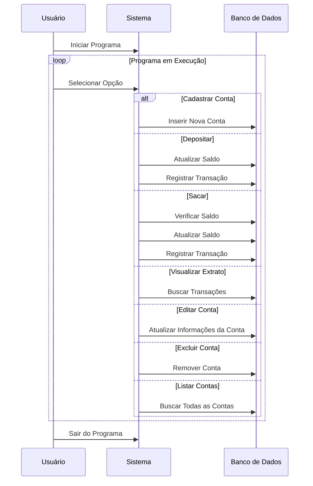
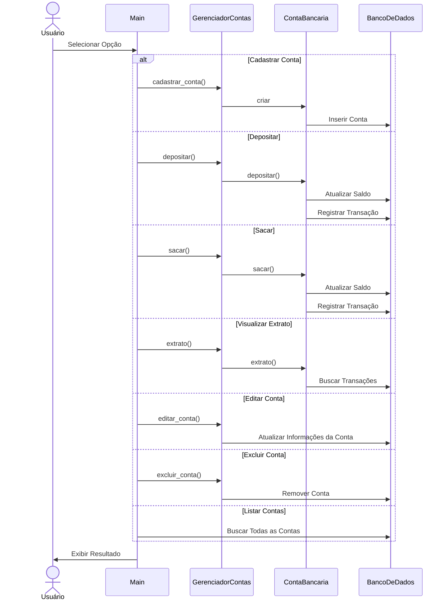
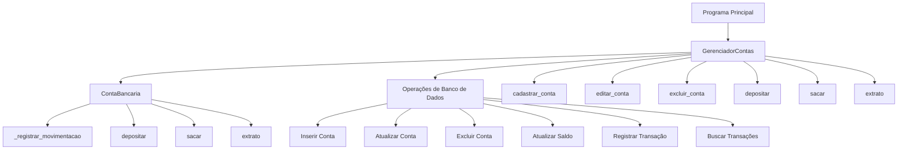

<h1 align="center" style="font-weight: bold;
">Sistema Bancário 🏦</h1>

<p align="center">
 <a href="#Tecnologias">Tecnologias</a> • 
 <a href="#Pré-requisitos">Pré-requisitos</a>•
 <a href="#Começando">Começando</a>•
 <a href="#Execução">Execução</a>• 
 <a href="#Funcionalidades">Funcionalidades</a>• 
 <a href="#Diagramas">Diagramas</a>•
 <a href="#Colaboradores">Colaboradores</a>
 
</p>

<p align="center">
    <b> Sistema básico de gerenciamento de contas bancárias em Python</b>
</p>

<h2 id="Tecnologias">💻 Tecnologias</h2>

- Python
- Mysql

<h3 id="Pré-requisitos">Pré-requisitos</h3>

Antes de começar, verifique se as seguintes tecnologias estão instaladas:

- [Python](https://www.python.org/downloads/)
- [Mysql](https://dev.mysql.com/downloads/installer/)

<h2 id="Começando">🚀 Começando</h2>

- Clone o repositório ou baixe o arquivo do código-fonte.

- Instale a biblioteca necessária usando pip:

```pip install mysql-connector-python```

```pip install datetime```

- Configure o banco de dados MySQL:
   - Crie um banco de dados chamado `banco_db`
   - Crie as tabelas necessárias executando os seguintes comandos SQL:

     ```sql
     CREATE DATABASE IF NOT EXISTS banco_db;
     USE banco_db;
     
     CREATE TABLE contas_bancarias (
         numero_conta VARCHAR(20) PRIMARY KEY,
         nome_usuario VARCHAR(100),
         data_abertura DATETIME,
         tipo_conta CHAR(1),
         saldo DECIMAL(10, 2)
     );

     CREATE TABLE movimentacoes (
         id INT AUTO_INCREMENT PRIMARY KEY,
         numero_conta VARCHAR(20),
         tipo VARCHAR(20),
         valor DECIMAL(10, 2),
         data DATETIME,
         FOREIGN KEY (numero_conta) REFERENCES contas_bancarias(numero_conta)
     );
     ```

- Ajuste as configurações de conexão com o banco de dados no arquivo Python:
   ```python
   db_config = {
       'user': 'seu_usuario',
       'password': 'sua_senha',
       'host': 'localhost',
       'database': 'banco_db'
   }
   ```

<h2 id="Execução">➡️ Execução</h2>
Para executar o programa, navegue até o diretório contendo o arquivo Python e execute:

```
main_sistema_bancario.py
```
<h2 id="Funcionalidades">⚙️ Funcionalidades</h2>

- **Cadastrar nova conta**: Permite criar uma nova conta bancária, especificando o nome do usuário, número da conta e tipo de conta (poupança ou corrente).

- **Listar contas**: Exibe todas as contas cadastradas no sistema, mostrando o número da conta, nome do usuário, tipo de conta e saldo atual.

- **Depositar**: Permite realizar um depósito em uma conta específica, atualizando o saldo e registrando a transação.

- **Sacar**: Permite realizar um saque de uma conta específica, verificando se há saldo suficiente, atualizando o saldo e registrando a transação.

- **Extrato**: Exibe o extrato de uma conta específica, mostrando todas as transações realizadas (depósitos e saques) com suas respectivas datas.

- **Editar conta**: Permite editar o nome do usuário associado a uma conta específica.

- **Excluir conta**: Remove uma conta do sistema, incluindo todas as suas transações associadas.

O sistema utiliza classes para representar contas bancárias (`ContaBancaria`) e para gerenciar as operações (`GerenciadorContas`). Todas as operações são refletidas tanto na memória do programa quanto no banco de dados MySQL, garantindo a persistência dos dados.

O programa principal (`main()`) apresenta um menu interativo no console, permitindo ao usuário escolher entre as diferentes operações disponíveis.

<h2 id="Diagramas">📊 Diagramas</h2>

- **Diagrama de Usuário**

O diagrama abaixo ilustra as interações dos usuários (gerente e correntistas) com o sistema:



 - **Diagrama de Tempo**

Este diagrama mostra a sequência temporal das operações dentro do sistema:



- **Diagrama de Sequência**

Este diagrama ilustra a troca de mensagens entre os objetos ou componentes do sistema durante as operações:



- **Diagrama de Operações**

Este diagrama detalha as operações principais do sistema e suas interações:



<h2 id="colaboradores">🤝 Colaboradores</h2>

- [Jordan Lima](https://github.com/Jordanfl)
- [Arthur Santana](https://github.com/arthurdsm1)
